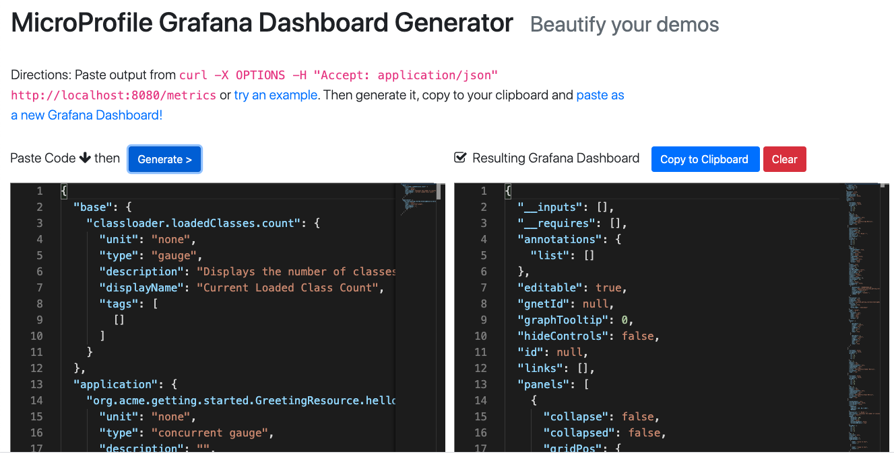
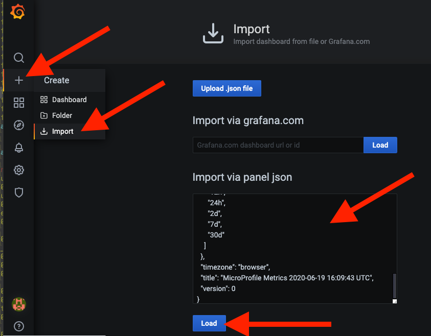
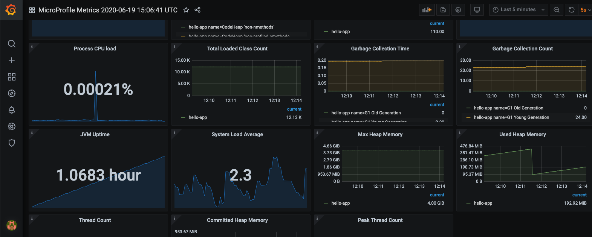

## MicroProfile Metrics Generator

This project presents a web frontend to generate Grafana dashboards that show metrics from
a MicroProfile application.


## Prereqs

You don't need a running prometheus or grafana to generate dashboards using this app, But for those who want to see the actual dashboards in action, you'll need them. See instructions later on for running prometheus and grafana.

To run this app locally, you'll need to install [jsonnet](https://jsonnet.org/) and [grafonnet](https://grafana.github.io/grafonnet-lib/).

You'll also need `git`, `npm`, `node`, `curl`, etc. To run grafana and prometheus locally you'll need `docker`.

First, clone this repo with `git clone` to your local desktop and move into the top-level directory of the cloned repo.

Then:

## Linux: Install jsonnet and grafonnet

```sh
curl -L -o jsonnet.tar.gz https://github.com/google/jsonnet/releases/download/v0.16.0/jsonnet-bin-v0.16.0-linux.tar.gz
tar -xvzf jsonnet.tar.gz
git clone https://github.com/grafana/grafonnet-lib.git
```

## Mac: Install jsonnet and grafonnet

```sh
brew install jsonnet
git clone https://github.com/grafana/grafonnet-lib.git
```

If you don't use HomeBrew then check out [these install instructions](https://github.com/google/jsonnet#packages) to get the `brew` command.

## Ensure MicroProfile app is running

Prometheus will look for metrics at `http://localhost:8080/metrics` so be sure it's running! You can use the sample app (built with [Quarkus](https://quarkus.io) ) if you want to test drive a real app. Run it in a separate terminal with `mvn -f sampleapp quarkus:dev` and then ensure metrics are available at `http://localhost:8080/metrics`.

With your app running, you can generate the necessary content that this tool consumes. Run the following and capture the output (either in a text file or just copy it to your clipboard):

```sh
curl -X OPTIONS -H "Accept: application/json" http://[APP_URL]/metrics
```

This outputs MicroProfile metrics metadata which this tool consumes.

## Running the generator app

First, set the following environment variables to tell the app where things are:

```sh
export JSONNET_BIN=$(which jsonnet) # set to the path of the jsonnet binary
export JSONNET_LIB=$(pwd)/grafonnet-lib # or wherever you cloned it to
export JSONNET_FILE=$(pwd)/dashboards/microprofile.jsonnet # the jsonnet processor for microprofile metrics
export PORT=8081 # or a different port if 8081 is taken
```

Run the generator app from the base directory of this repo with:

```
npm install
npm start
```

Then visit `http://localhost:8081` and follow the instructions to generate a dashboard, and copy it to your clipboard.



## Generating dashboards using `curl`

Instead of using the GUI, you can directly access the generator using `curl`. For example, you can use the sample MicroProfile metrics in this repo:

```sh
curl -X POST -d @./public/example.json http://localhost:8081/processRaw
```

This will return the generated dashboard as a JSON document.

## Import into Grafana

With your dashboard JSON, in Grafana, add a new Dashboard with the `+` button and choose `Import`, and paste the JSON dashboard into the field and click **Load**.



And enjoy your new metrics:



At this point you can edit the dashboard until you are happy with it, save it, check it into source control, or throw it away and start again!

## Optional: Run prometheus and grafana via `docker`

If you already have a [Prometheus](https://prometheus.io/) and [Grafana](https://grafana.com/) instance up and running and hooked together, you'll need to configure Prometheus to scrape metrics from your app. Check out the [Prometheus configuration docs](https://prometheus.io/docs/prometheus/latest/configuration/configuration/) on how to do it.

To run using the pre-defined jobs in this repo, first it is assumed the MicroProfile app you wish to visualize is running on your local machine at `localhost:8080` and exposes its metrics at `localhost:8080/metrics`. You can edit `prometheus/prometheus.yml` in this repo if you need to change how prometheus finds your app.

Next, in a separate terminal, run Prometheus with `cd prometheus; ./runlocal.sh`. This starts prometheus using `docker` and configures it to look for your app at the special hostname `host.docker.internal` which refers to your local desktop host.

Access prometheus at `http://localhost:9090` and confirm you can access your app's metrics using the query browser.

Next, in another separate terminal, run Grafana locally with the `cd grafana; ./runlocal.sh`, which has been pre-configured for the prometheus you just invoked.

Check Grafana is working at `http://localhost:3000`. Login with the default credentials `admin/admin`.
